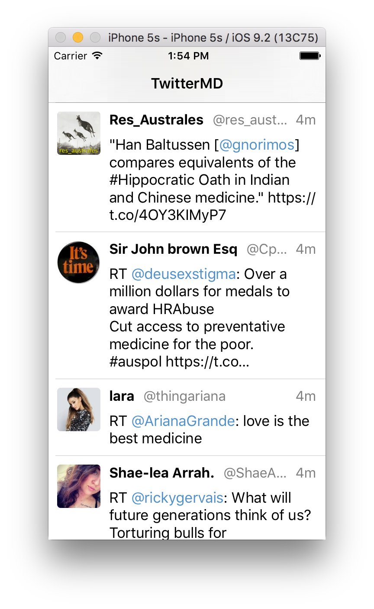

# TweetMD

TweetMD helps you stay up to date on the latest medical tweets! It uses the [Twitter API](https://dev.twitter.com/rest/public) to fetch the top 30 recent tweets about 'medicine' and displays them for your viewing pleasure (regardless of actual relevance to medicine...)

It's coming along, but we need your help to polish it up!

### Getting Set Up
1. Clone this repo: `git clone git@github.com:doximity/tweetmd.git`
2. If you don't have [Cocoapods](https://cocoapods.org/about), install it with the following commands:
  * `sudo gem install cocoapods`
  * Restart your terminal
  * `pod setup`
2. `pod install`
3. Open TweetMD.xcworkspace

### Submission Instructions

* Create a local branch named with the following format: `firstName_lastName_tweetMD`
* Code all your updates in **Objective-C**
* **DO NOT PUSH TO MASTER, DO NOT FORK THE REPOSITORY**
* Push your branch to Github
* Once all work is completed, create a new pull request (`firstName lastName - Tweet MD`) between master and your branch
* Tag @kimikul on your pull request message to notify us that you've completed your assignment. If you want to include any additional comments about your solution, do so here.

### We are looking for:
* Clean, optimized, well-organized code
* Understanding of Cocoa design patterns and autolayout
* Ability to interpret and leverage existing code, documentation
* Correctness of implementation according to spec

### Limitations
* We know you are eager to show us what you can do, but please don't do more than what is specifically requested in the tasks
* Do not integrate additional libraries, but feel free to utilize any functionality from the libraries already included
* TweetMD accesses the Twitter API through a guest account and is subject to guest rate limits. If you exceed the rate limit (not likely), the app may fail to load tweets and/or photos momentarily. Don't worry! In our experience, the throttle lasts just a few seconds.

# Tasks
###Task 1

The cells on the tweet feed need a few UI updates
  1. The top text in each cell contains 3 pieces of information: the user's name, the user's handle, and the time elapsed since the tweet was posted. The name and handle should stick to the left, and the time label should stick to the right. If there is not enough space to fit all three labels, first truncate the handle, then truncate the name. The time label should always display completely.
  2. The cells are not optimized for various device sizes. Update the cells so that their views are laid out consistently on various device sizes.
  3. Each cell currently shows only one line of the tweet body. Update the cells so they size themselves to fit the entire tweet body text.

The final tweet feed should look something like this: 

*NOTE: Aside from the updates listed above, all other spacing and sizing should not change from the original.*

### Task 2
The images on the tweet feed take a while to load and cause some lag while scrolling. Update the image loading logic to eliminate the lag.

### Task 3
  1. The date label sometimes shows the incorrect time elapsed string. Please fix this!
  2. To avoid future issues with the time elapsed labels, write some tests using XCTest to ensure that this method continues to work correctly.

### Task 4
We want to highlight user mentions (e.g., @doximity) in the tweet body. To do so, we need to capture user mention objects from the tweet response JSON. Fill out the `TMUserMention` object to serialize user mentions.

*NOTE: The screenshot in Task 1 correctly displays highlighted user mentions. You do not need to implement clicking on a highlighted user mention. You do not need to highlight other items (links, hashtags, etc)*

### Task 5

Currently, the button to 'star' a tweet exists, but it doesn't do anything. Implement the 'star' and 'unstar' functionality as follows:
  * When items are starred:
    1. The button should have background color [UIColor starredYellow]
    2. The button text should be "Starred!"
    3. The corresponding row on the home feed should have background color [UIColor starredYellow]

  * When items are not starred:
    1. The button should have background color [UIColor actionBlue]
    2. The button text should be "Star this Tweet"
    3. The corresponding row on the home feed should have background color [UIColor whiteColor]

*NOTE: Starred tweets do not need to persist across sessions. This means that when I kill / restart the app, my previous stars do not need to be saved.*
